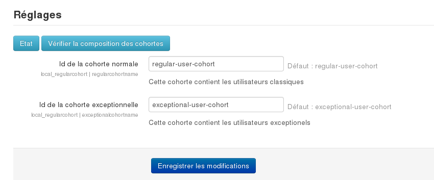
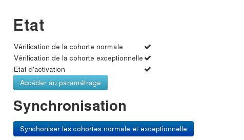

# Utilisation du plugin regularcohort

## Principe

Le but de ce plugin est de permettre d'utiliser la fonctionnalité native de moodle de limitation de l'auto-inscription à un cours pour une cohorte.

En clair, nous allons restreindre l'auto-inscription pour les cours sensibles à une cohorte contenant les utilisateurs réguliers. 

Les utilisateurs exceptionnels ne pourront pas s'auto-inscrire tandis que les utilisateurs réguliers pourront s'auto-inscrire.

Le plugin permet de gérer et de synchroniser ces cohortes.
 

## Cohortes

Créer 2 cohortes:
- une cohorte pour les utilisateurs réguliers. Relevez l'identifiant de la cohorte. Par exemple :   `regular-user-cohort`.
- une cohorte pour les utilisateurs exceptionnels. Par exemple: `exceptional-user-cohort`.

## Paramétrer le plugin

Il faut maintenant renseigner dans le plugin les identifiants des 2 cohortes : `Administration du site / ► Plugins / ► Plugins locaux / ► Gestion des utilisateurs réguliers et exceptionels`

## Comment restreindre l'accès à un cours sensible aux utilisateurs réguliers ?

Dans le cours en question, restreindre l'auto-inscription aux membres de la cohortes des utilisateurs réguliers et enregistrer.
Ainsi seuls, les membres de la cohorte des utilisateurs réguliers pourront s'auto-inscrire.

## Comment définir un utilisateur comme étant exceptionnel ?

Pour cela, il suffit d'ajouter l'utilisateur en question à la cohorte des utilisateurs exceptionnels. 

Si l'utilisateur est membre de la membre de la cohorte régulière, il sera enlevé automatiquement de la cohorte régulière à la [prochaine synchronisation](#déclenchement). 

Si vous ne souhaitez pas attendre la prochaine synchronisation, vous pouvez l'enlever manuellement de la cohorte régulière.  

## Comment fonctionne la synchronisation des cohortes ?

### Principe

- Tout utilisateur qui est membre de la cohorte exceptionelle sera enlevé de la cohorte régulière lors de la synchronisation
- Les utilisateurs vont par défaut dans la cohorte régulière

### Déclenchement

- La synchronisation initiale peut être lancée via le bouton de synchronisation. 
- La synchronisation des cohortes est déclenchée à chaque connexion et mise à jour de profil.

